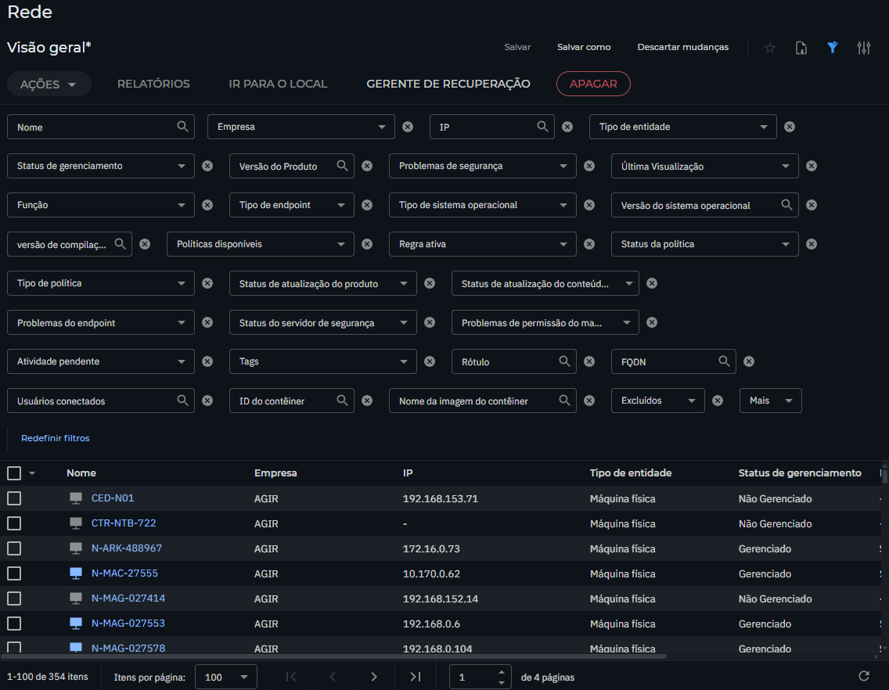
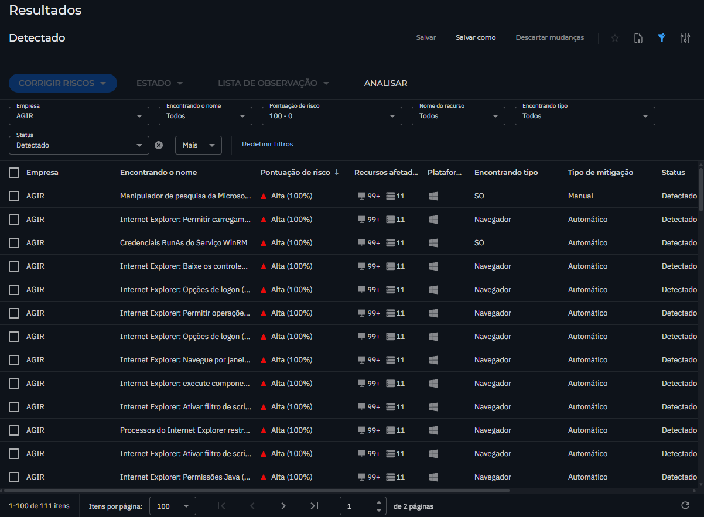
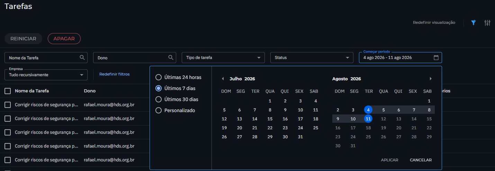
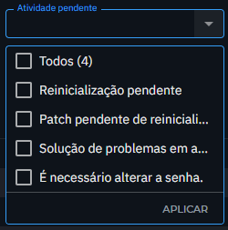

# Anotações e Ideias

## Branding
Rodapé: GECTI: Gerência Corporativa de Tecnologia da Informação
 
Autenticação: Interna (possibilidades para implementação futura: LDAP, Portal Agir)
 
Nome e Titulo: Governança Corporativa dos Indicadores de TI

Titulo Aba: Indicadores de TI

---

## Unidades Reais

AGIR - Corporativo
CHS - Complexo Hospitalar Sul
CRER - Centro Estadual de Reabilitação e Readaptação Dr. Henrique Santillo
HDS - Hospital Estadual de Dermatologia Sanitária Colônia Santa Marta
HECAD - Hospital Estadual da Criança e do Adolescente
HEJ -  Hospital Estadual de Jataí Doutor Serafim de Carvalho
HUGOL - Hospital Estadual de Urgências Governador Otávio Lage de Siqueira
HRD - Hospital Regional de Dourados
PLCGO - Policlínica Estadual Brasil Bruno de Bastos Neto Região Rio Vermelho - Goiás

---

## Prazos

Prazo de entrega: dia 10, estando vencido a partir do dia 11, independentemente do dia da semana
Papel da Unidade: Elaborar e Publicar
Papel do Corporativo: Validar e Aprovar 

---

## Paginas

1. Painel Central: Tela principal do sistema, exibe uma visão geral. 
    - Visivel para Revisores, Aprovadores e Administradores.

2. Mesa de Elaboração: Similar ao Painel Central, mas voltado 
    - Visivel para todos.
    - abas internar para subpaginas de `Elaboração e Revisão` e `Cadastros de Resistentes`.

3. Mesa de Aprovação: Tela para o usuário aprovar ou recusar os indicadores dos relatorios.
    - Visivel para Aprovadores e Administradores.

4. Auditoria - Tela para o usuário visualizar as ações realizadas no sistema.
    - Visivel para Revisores e Administradores.
    - Exibe uma lista de ações realizadas, incluindo data, hora, usuário e ação realizada.
        
5. Administração - Tela para o usuário configurar as preferências do sistema.
    - Visivel para Administradores.
6. 

### Painel central

#### Colunas (Grid)
1: Unidade
2: Período
3: Status (Pendente, Atrasado, Em Andamento, Em Revisão, Concluído, Aprovado, Reprovado)
4: Publicação (ref. ao envio com data e hora, cor referente ao envio dentro ou fora do prazo)
5: Aprovação (ref. à validação com data e hora: Pendente, Aprovado, Reprovado)
6: Pontuação: (1 indicador cumprido = 1 ponto) + 1 ponto por publicação dentro do prazo
→ N1: 5+1 / N2: 9+1 / N3: 13+1
7: Ações (precisa ser dinâmica, de acordo com o status do relatório, opções de exportação disponiveis somente para relatórios em status 'APROVADO')

#### quantitativo

Exiba os quantitativos de relatorios das seguintes formas e utilizando os seguintes textos para descrevelos. 
1. Total de Relatorios registrados
2. Pendentes
3. Atrasados
4. Em Andamento
5. Em Revisão
6. Em Aprovação
7. Aprovados

### Mesa de Elaboração

- aba de subpagina Elaboração e Revisão - Tela onde é realizado a Elaboração (preenchimento do formulário de cad indicadores e ).
- aba de subpagina Cadastros de Resistentes - Tela onde é realizado o cadastro de resistentes (cadastro de servidores, de maquinas virtuais, de licenças, de todos os itens resistentes de indicadores).

### Mesa de Validação

### Auditoria

- aba de subpagina de Dashboard - graficos de quantitativos (1. Total de Relatorios registrados, 2. Pendentes, 3. Em Andamento, 4. Em Revisão, 5. Em Aprovação, 6. Aprovados) e graficos de pontuação media de unidade dos ultimos 6 meses, progressão de evolução.
- aba de subpagina Auditoria - Tela onde é realizada a auditoria de todas as ações realizadas no sistema.

Filtros estão mal feitos e mal possicionados, 

problemas identificados:
1. as siglas das unidades não estão sendo devidamente apresentado, onde deveria esta a sigla da unidade, exibe um codigo como "03aa35f9-8f15-4d51-aaa1-2c6b58317efc". 
2. os titulos das colulas estao estranhas, exibindo "N1N3_AMEACAS_RESPOSTA_A_MALWARES" em vez de um nome legivel e agradavel. 
3. os filtros de multseleção, devem ter um checkbox para selecionar todos os registros que correspondem à condição, como varas unidades ou varios niveis de relatorios. 
4. os niveis de relatorios estao como A e B, sendo que definimos que seria N1, N2 e N3. 

abaixo estão as imagens de referencia de como o filtro deveria ser feito:

### Administração

---
